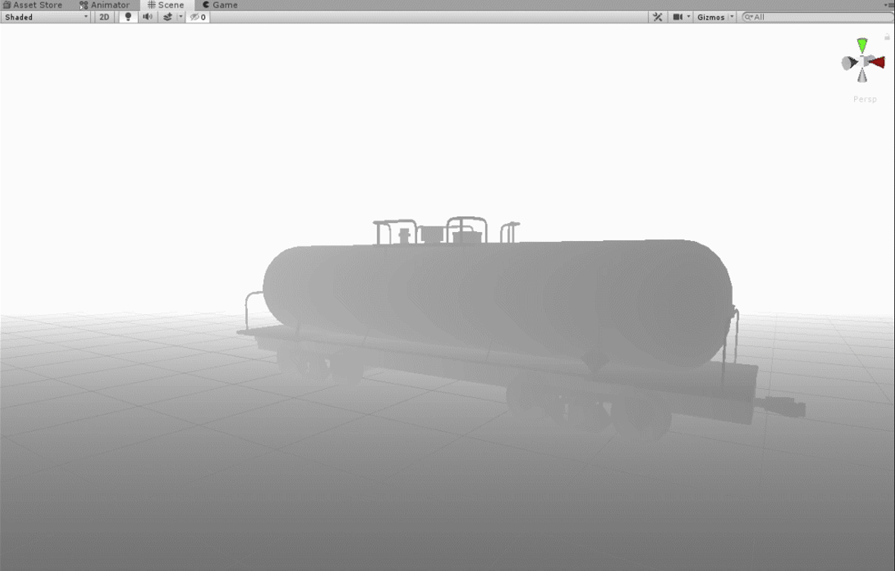

# SceneViewDepth
Recently I needed to render depth directly inside of Unity SceneView for debug purpose. Initialy it was part of custom tool for editor. But it can be easyly converted to be used with other kind of custom editors or to Blit result to some kind of Texture, etc.

## Preview

&NewLine;
(space)
&NewLine;

Note:If you see only black and white values while tool is active, try to adjust settings of scene camera far clip
### Geometry Shader and Tool script
All magic is done by  "Assets\Shaders\GS_DepthDebug.shader" 
And EditorTool script "Assets\Editor\SceneViewDepth.cs"

